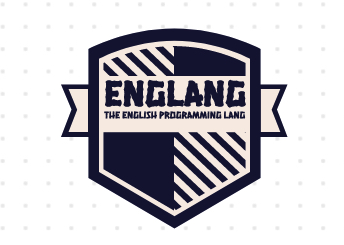
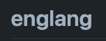

  <a href="https://github.com/KittyX29/englang">
    </img> 
    </img>
  </a>
    
  
    
  

# englang

It is not england :)

## This is a programming language !

#### Alright, there are so many langs, why one more you may ask :

##### Here's the story :

- When I was learning python, my first programming language, I had trouble learning the syntax, indentation and to just make what I wanted, learning all this was just too much.

- Thats why I wanted to make a language to help people who are new to programming in order to understand datatypes, structs etc. but without having to bother learning the syntax, indentation.

### Licensing:

Each and every file in this repository are licensed under the Apache-2.0 License are are subject to copyright under KittyX29 and the englang contributors

### Extra Info:

1. Dont just fork this repo, remember to star it too! 🌟

### Contact:

Discord : https://discord.gg/YfwfA4JbdW

Website : https://kittyx29.github.io/englang

### Contributors:

- [@KittyX29](https://github.com/KittyX29) - Founder
- [@Odyssey346](https://github.com/Odyssey346) - Contributor
- [@TheOtterlord](https://github.com/TheOtterlord) - Contributor
- [@Shadofer](https://github.com/Shadofer) - Contibutor
